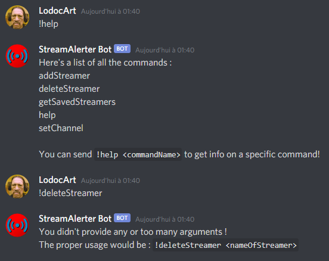

# StreamAlerter

## Auteurs
- Ernesto ARTIGAS
- Alexandre FOVET

# Présentation

StreamAlerter est un projet de Master sur les WebServices qui se décompose en deux parties :
- StreamAlerter.API : Une API Rest qui contacte l'API de Twitch pour récupérer la liste des Streamers enregistrés qui sont en live. Il est codé en C# avec l'utilisation du framework [.NET](https://dotnet.microsoft.com).
- StreamAlerter Bot : Un Bot Discord qui contacte périodiquement l'API Rest pour savoir si les streamers sont en live ou non. S'ils le sont, le bot envoie un message pour annoncer le live. Il est codé en [Node.js](https://nodejs.org/en/) avec l'utilisation du framework [discord.js](https://discord.js.org/#/).

**Le projet est fait en pair programming, les conditions sanitaires nous obligeant à utiliser le Live Share de Visual Studio et Visual Studio Code pour travailler plus efficacement. Les commits seront donc très souvent assignés à la même personne pour cette raison.**

## Quelques précisions de vocabulaire

- [Twitch](https://www.twitch.tv/) est un service permétant de diffuser du contenu en direct (streaming vidéo)
	- Un streamer est une personne qui diffuse du contenu en direct sur Twitch, on peut aussi dire que cette personne "live" (Direct)

- [Discord](https://discord.com/brand-new) est un logiciel ayant pour but de rassembler tous les logiciels de VoIP existants comme Skype ou TeamSpeak dans un seul logiciel.
	- On parlera de "salon" et de "channel" Discord, qui ne sont autre que les lieux où l'on peut communiquer et envoyer des messages aux utilisateurs présents.


# Usage

## Préparations

Il vous faudra :
- Obtenir un token pour l'insérer dans le fichier config.json, à la ligne "token".
- Ouvrir la solution avec Visual Studio pour lancer toutes les couches de l'API.
- Lancer le bot Discord et l'inviter sur votre serveur avec le lien ci [dessous](https://discord.com/oauth2/authorize?client_id=828792027542061087&scope=bot+applications.commands).
- Utiliser la commande !setChannel avec en argument le salon à utiliser.
- Ajouter des streamers avec les commandes !addStreamer et !getLiveStreamers.

## Commandes d'initialisation de la base de donnée-

```bash
cd streamalerter/src/StreamAlerter.Api/StreamAlerter.DatabaseRepository
dotnet ef --startup-project ..\StreamAlerter.Api migrations add InitialCreate
dotnet ef --startup-project ..\StreamAlerter.Api database update
```


## Commandes d'installation et utilisation du bot

```bash
cd streamalerter/src/streamAlerterBot
npm install

# Pour lancer le bot.
npm start
```

## Commandes d'utilisation

Ci-dessous, les commandes d'utilisation de notre service à écrire dans le salon où se trouve le StreamAlerter Bot, ainsi que leurs fonctions :

-	**!help "nameCommand"** -> Lister toutes les commandes existantes et les décrivant.
-	**!setChannel "nameChannel"** -> Définir le salon où le bot devra écrire. Doit absolument respecter être une référence à un salon existant, avec l'utilisation de # au début du nom.
-	**!getLiveStreamers** -> Obtenir la liste des streamers actuellement en live et qui ont été enregistré dans la base de donnée
-	**!getSavedStreamers** -> Obtenir la liste des streamers présent dans la base de donnée
-	**!addStreamer nameOfYourStreamer** -> Ajouter un streamer dans la base de donnée (ici, le streamer "nameOfYourStreamer" sera ajouté)
-	**!deleteStreamer nameOfYouStreame** -> Supprimer un streamer dans la base de donnée (ici, le streamer "nameOfYourStreamer" sera supprimé)


# Explications

Malgré le concept de notre application qui peut être assez simpliste, elle a néanmoins soulevé beaucoup d'intérogations:
Tout d'abord, nous avons dû (re)découvrir le fonctionnement d'un bot discord qui est codé en JavaScript. 
Notre application devra concrétement envoyer des messages dans un channel discord, il a fallu dans un premier temps réapprendre à utiliser un bot discord tout en pensant au fait qu'il agira grâce à notre API StreamAlerter. Après y avoir réfléchit, nous avons décidé que notre bot Discord devra vérifier périodiquement si une personne live ou non et donc, par intervalles, envoyer ou non un message qui indique s'implement le lien de la personne en live.
Ici, nous pouvons déjà relever plusieurs remarques : 
- Comment savoir si une personne est en live ou non?
- Comment vérifier seulement les streamers qui nous intéresses, et non la totalité des streamers présent sur Twitch? 

Comme dit précèdemment, notre propre API va contacter l'API de Twitch qui permet de récupérer de nombreuses données telles que les utilisateurs de twitch, ainsi que leurs propriétés comme le fait qu'ils soient en live ou non ! Notre API va donc se charger de traiter ces données proprement pour les réutiliser par la suite.
Maintenant, nous voulons être averti par les streamers qui nous intéresse seulement : nous avons donc décidé de créer une base de données qui permettra de stocker tous les streamers qui nous intéresse. De ce fait, nous traitons mieux les données, et nous récupérons seulement ce qui nous intéresse et l'API peut donc transmettre ces informations à notre bot Discord.

Il y a cependant une remarque à faire ici: si une personne live, il serait embêtant de renvoyer le message d'annonce chaque minutes dans le channel discord.
Ceci dit, comment faire alors si un nouveau streamer se met à liver pendant qu'une autre personne live déjà ? Il faudra bien annoncer que cette nouvelle personne ait lancé son live!
Nous avons donc pensé à deux solutions : 
- Utiliser une seconde base de données pour y stocker les streamers en cours.
- Utiliser une simple liste. 

Etant donnée que les streamers en cours ne sont pas primordiaux comparé à la base de données permanente qui est celle des streamers enregistrés, nous avons préféré partir sur une liste pour une simplicité des résultats. Si l'application devait se relancer et qu'un streamer était déjà en live il y aurait une nouvelle notification mais qui ne serait pas dévastatrice.

Enfin, nous avons fait en sorte que les commandes d'utilisation soit simple à utiliser, et nous avons veillé à avertir l'utilisateur sur le résultat de sa commande à chaque fois. Il saura donc si sa commande a été réalisé avec succès, ou s'il y a eu une erreur comme une erreur de syntaxe. Dans ce dernier cas, des explications seront fournie par le bot Discord directement dans le channel.

## Quelques détails sur les routes d'API

- **Put** : Permet d'ajouter un streamer. *La Post est la route privilégiée pour l'insertion de valeur étant donné sa flexibilité et sa possibilité de mettre à jour des données.*
- **Post** : Permet d'ajouter un streamer s'il n'exite pas. Son implémentation ici ne diffère pas de la put car nous n'avons pas de paramètre à modifier (Pour le moment, il y a seulement le nom et l'état du streamer que l'on enregistre), mais par la suite on pourrait rajouter d'autres détails, nous en discuterons dans la partie "Perspective d'amélioration".
- **Delete** : Permet de supprimer un streamer de la base de donnée.
- **2 Get** :
	- La route StreamAleter de base pour renvoyer les streamer que l'on a enregistrés
	- La route StreamAlerter/getLiveStreamers qui permet d'avoir les streamers qui sont actuellement en live 

Chaque commande d'utilisation à écrire dans le salon Discord fait appel à l'une de ces routes.

## Quelques Détails au niveau du code du bot Discord

Un problème que nous avons rencontré est que lorsqu'une personne se trompe au niveau d'une commande, le bot Discord va envoyer un message pour informer l'utilisateur.
Le message ressemble à celui-ci, en deux lignes.
```
Wrong syntax. You need to write :
!addStreamer nameOfYourStreamer
```

On peut se dire que tout va bien, mais la commande de la deuxième ligne va être executé, ce qui donne lieu à l'ajout du streamer "nameOfYourStreamer" dans la base de donnée ! 
Pour pallier le problème, il est nécessaire d'ajouter cette ligne de code suivante afin de ne pas prendre en compte les mauvais messages ainsi que ceux du Bot en commandes :
```js
if (!message.content.startsWith(prefix) && !message.author.bot) return;
```

Pour plus de simplicité, nous avons choisi d'introduire les deux lignes suivantes, qui permettent de mieux traiter la commande par la suite :
```js
const args = message.content.slice(prefix.length).trim().split(" ");
const command = args.shift();
```

Finalement nous avons procédé à un gros refactoring du code, permettant de pallier aux différents problèmes sus-nommés avec l'utilisation d'un Command Handler capable de tester les commandes, d'envoyer un message formaté pour chaque commande, celle ci intégrant une description de son utilisation et de ses arguments nécessaires. Ainsi, si on se trompe dans une commande on peut désormais avoir ce type de message :

```
You didn't provide any or too many arguments !
The proper usage would be : !deleteStreamer <nameOfStreamer>
```

De plus, nous avons désormais une commande help dynamique, capable de lister toutes les commandes existantes et d'expliciter une commande passée en argument, de ce type :



Le bot utilise un linter pour vérifier et garder une cohésion au sein du code NodeJS. Il peut être appelé et corriger les erreurs avec ces deux commandes respectives :

```bash
npm run linter
npm run linterFix
```

# Perspective d'amélioration

Au cours de nos travaux, nous avons réfléchit à plusieurs améliorations que nous pouvons apporter dans le futur.
Nous aimerions faire 
- Une update pour afficher des messages personnalisés.
- Les modifier comme on le souhaite et rajouter d'autres propriétés pour chaque streamer dans la base de données.
- Mettre l'API sur Azure et créer un nouveau service pour avoir une base de données personnalisée à chaque serveur, permettre de plus facilement utiliser le projet.

De plus, nous avions pensé à réaliser une interface web qui serait simple d'utilisation et permettrait d'éditer son propre message personel (pour le streamer), ou encore modifier d'autres eventuelles propriétés.

# Conclusion

Ce projet était très enrichissant : en effet, c'était la première fois que nous développions un service comme celui-ci. 
Nous avons donc appris à utiliser un Bot Discord ainsi que de découvrir comment fonctionne une API ainsi que toute son organisation autour de la structure des fichiers.
Nous avons également appris à utiliser des outils tels que Swagger ou encore Postman.